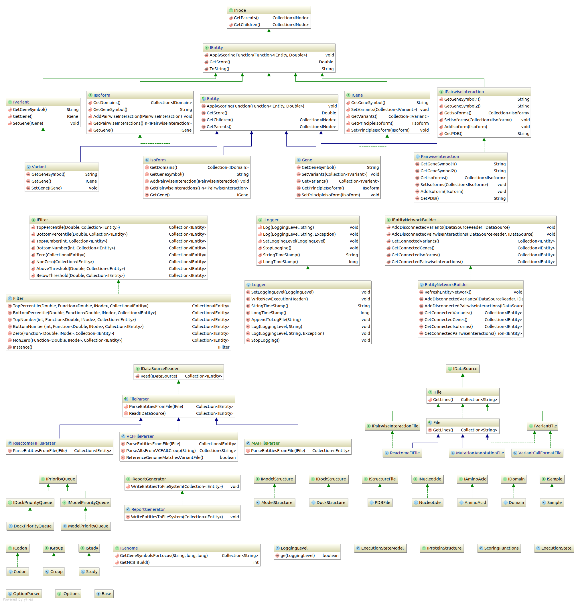

# FIOncoNet
using network comparison techniques to understand oncogenic mutations

## Java Implementation

### Class Diagram


### Structural Integration

#### Modeling Server
1. genes will point to primary isoform and actual (mutated) isoform  
2. modeling server will be queried during isoform creation for metrics, such as free energy  
3. modeling server hashtable (redis?) will map AA sequences to predicted models and return their metrics  
4. modeling server will return error if primary (unmutated) isoform prediction deviates too much from known structure  
5. mutational effect will be calculated as abs(1 - (primary isoform energy) / (mutated isoform energy))  

#### Docking Server
1. docking server will be queried during interaction creation for metrics, such as free energy  
3. docking server hashtable (redis?) will map AA-AA sequences to predicted complexes and return their metrics  
4. docking server will return error if primary (unmutated) complex prediction deviates too much from known structure  
5. mutational effect will be calculated as abs(1 - (primary complex energy) / (mutated complex energy)) 

### Links

#### Annotation for Release 19 (GRCh37.p13)
http://www.gencodegenes.org/releases/19.html

#### Map VCF Coordinates to Genes
http://annovar.openbioinformatics.org/en/latest/articles/VCF/
http://vcftools.sourceforge.net/
https://www.biostars.org/p/77440/

#### VCF
http://www.ncbi.nlm.nih.gov/variation/docs/human_variation_vcf/  
http://www.1000genomes.org/data  

## Python Prototype

### Architecture


### Usage
```
$ python3 serve_fi_structures.py
$ python3 prepare_fi_data.py
$ python3 update_fi_structures.py
$ python3 fion.py
$ python3 queue_fi_structures.py
```
