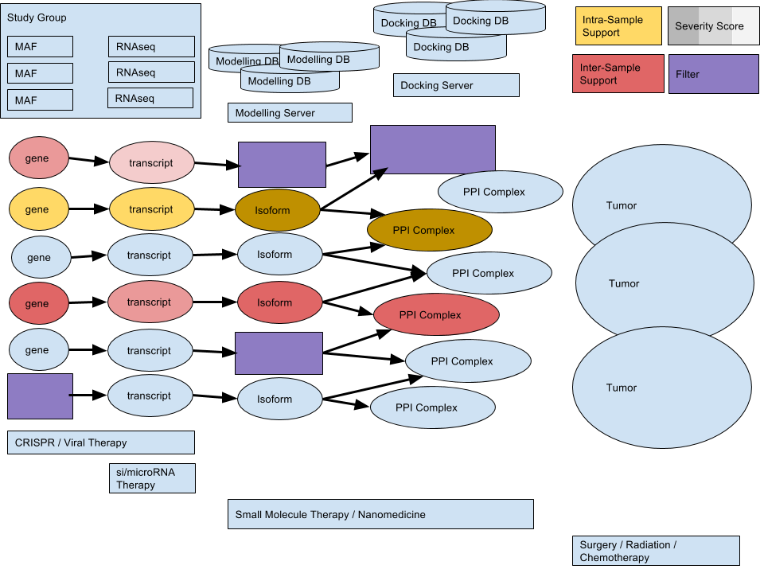

# FIOncoNet
using network comparison techniques to understand oncogenic mutations

## Java Implementation

### Class Diagram


### Links

#### Annotation for Release 19 (GRCh37.p13)
http://www.gencodegenes.org/releases/19.html

#### Map VCF Coordinates to Genes
http://annovar.openbioinformatics.org/en/latest/articles/VCF/
http://vcftools.sourceforge.net/
https://www.biostars.org/p/77440/

#### VCF
http://www.ncbi.nlm.nih.gov/variation/docs/human_variation_vcf/  
http://www.1000genomes.org/data  

## Python Prototype

### Architecture


### Usage
```
$ python3 serve_fi_structures.py
$ python3 prepare_fi_data.py
$ python3 update_fi_structures.py
$ python3 fion.py
$ python3 queue_fi_structures.py
```
